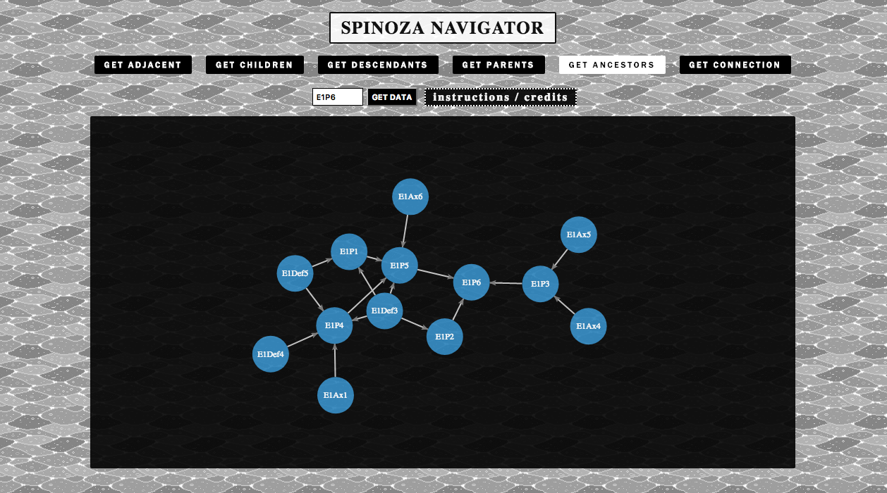

# spinoza-react
WEB APP FOR VISUALIZING SPINOZA'S ETHICS AS A GRAPH 

http://spinoza.jaimefps.com/

*MVP:*

MVP finalized.

*EXTRA FEATURES:*

1:: Node shape dependant on type (axiom, proposition, definition, etc);
2:: colorize the nodes given as input so as to distinguish them from the rest.
3:: get descendants and ancestors by degrees of separation.

TO RUN APP LOCALLY

`npm i`

`npm start`
